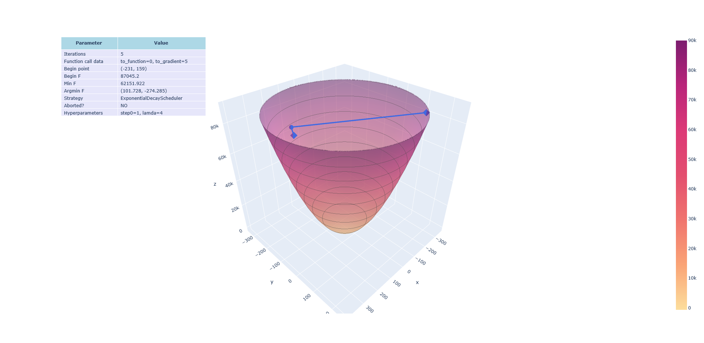
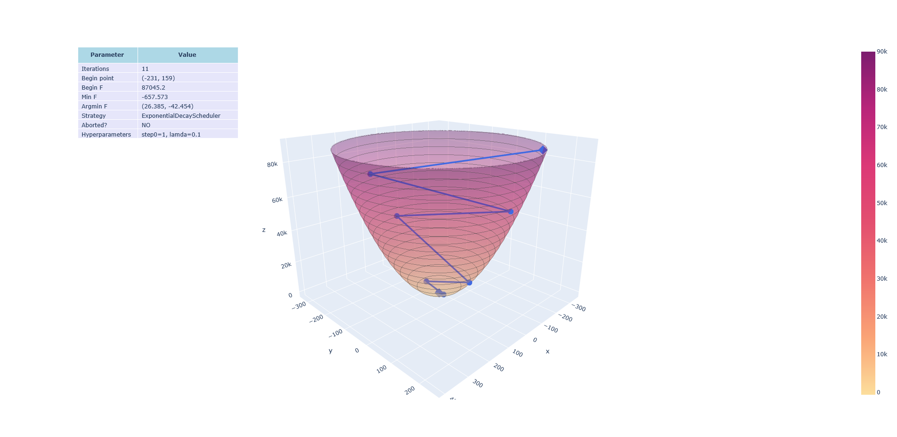
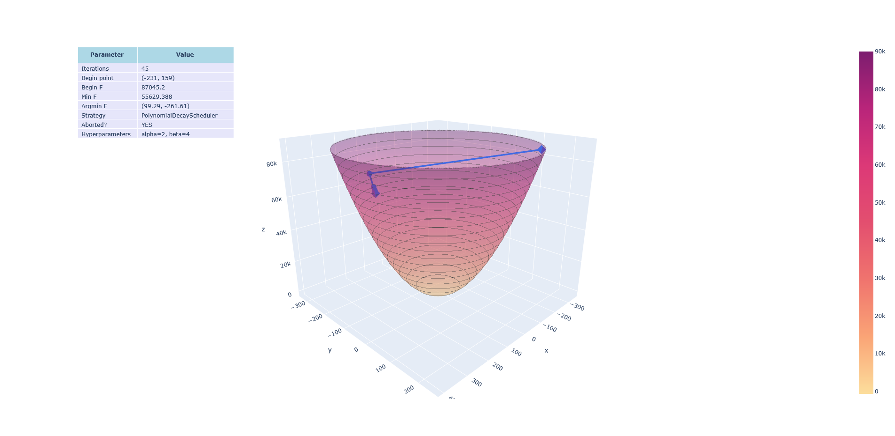
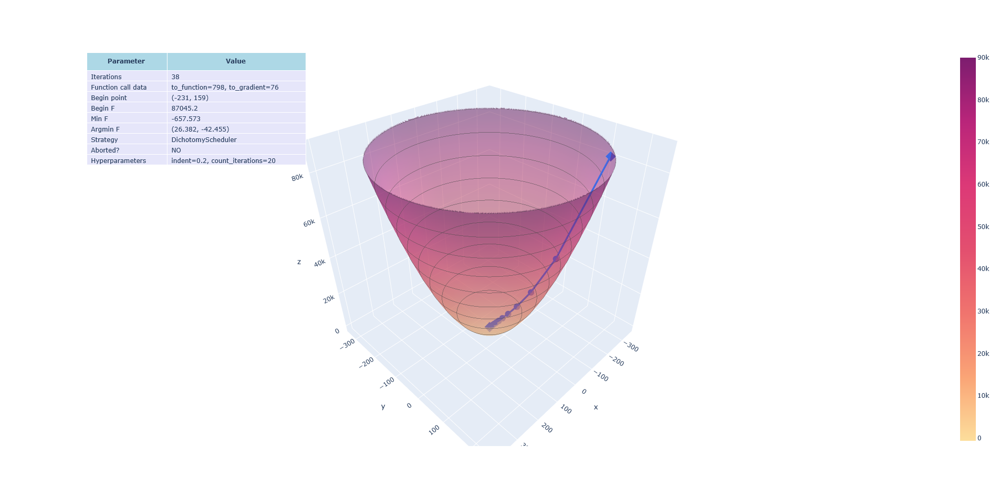
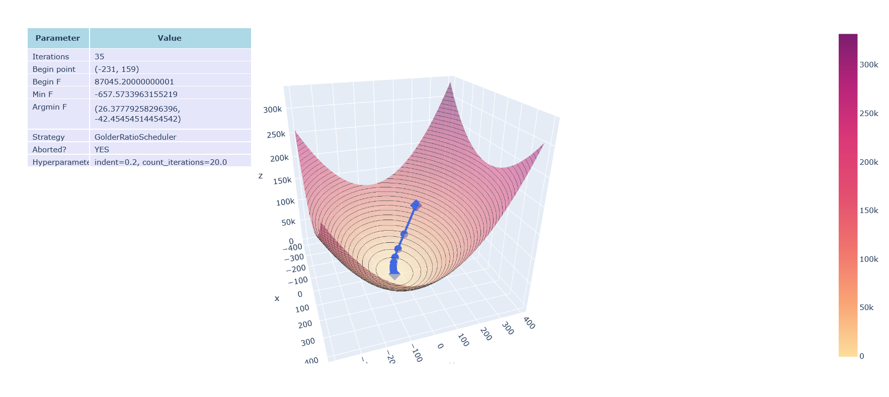
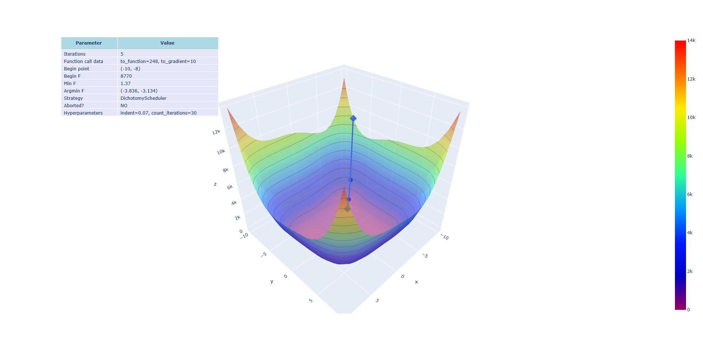
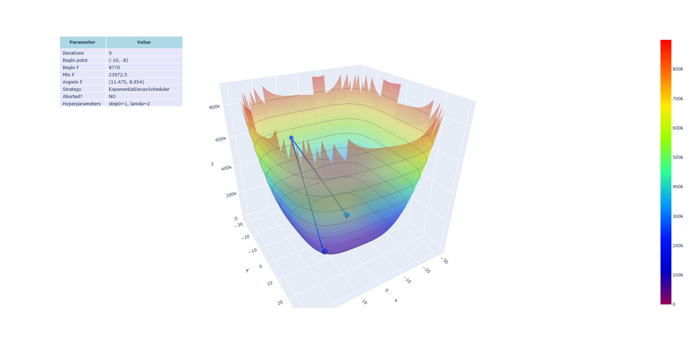
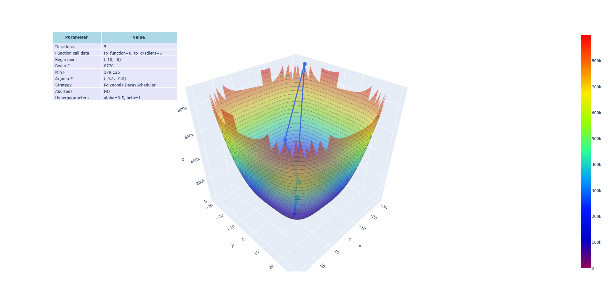

# Отчет по лабораторной работе №1 по дисциплине "Методы оптимизации"

## Сведения об авторах

Название команды: "Гипсокартонный лист(ГКЛ)"

Члены команды:

- Гилязов Валерий Русланович, М3232
- Кудрявцев Эдуард Сергеевич, М3235
- Лаптев Иван Александрович, М3232

## Описание используемых методов

### Метод градиентного спуска: обобщенное описание

Метод градиентного спуска используется для нахождения точки $x^ \cdot \in \mathbb{R}^n$ локального экстремума
дифференцируемых функций многих переменных
Порядок действий:

1. Выбирается начальная точка $x_0 \in \mathbb{R}^n$
2. Выбирается постоянный множитель $multiplier = 1$ при поиске максимума, иначе $multiplier=-1$
3. Выбирается стратегия выбора шага $getNextStep : \mathbb{R}^n \rightarrow \mathbb{R}$
4. Выбирается условие останова $isDone$
5. $x=x_0$
6. $x = x + multiplier \cdot getNextStep(x) \cdot grad_f (x)$, где $grad_f (x)$ - значение градиента функции $f$ в
   точке $x$
7. Если не выполняется $isDone$, перейти к пункту 6

### Стратегии выбора шага $getNextStep$

#### Тривиальные стратегии

##### Polynomial decay

| **Характеристика**          | **Информация**                                                                                                                                            |
|-----------------------------|-----------------------------------------------------------------------------------------------------------------------------------------------------------|
| **Библиотека:**             | Стандартная библиотека Python 3.12.5. Метод реализован самостоятельно.                                                                                    |
| **Описание:**               | Функциональный метод планирования шага, выбирающий k-ый шаг по формуле: $h(k) = h_0 \cdot  (\beta k + 1)^{-\lambda}$ $h_0 = \frac{1}{\sqrt{k + 1}}$ |
| **Гиперпараметры:**         | 𝛼, 𝛽 > 0                                                                                                                                                |
| **Особенности реализации:** | Рекомендуемые гиперпараметры: 𝛼 ≔ 0,5, 𝛽 ≔ 1                                                                                                            |

##### Exponential decay

| **Характеристика**          | **Информация**                                                                                                |
|-----------------------------|---------------------------------------------------------------------------------------------------------------|
| **Библиотека:**             | Стандартная библиотека Python 3.12.5. Метод реализован самостоятельно.                                        |
| **Описание:**               | Функциональный метод планирования шага, выбирающий k-ый шаг по формуле: $h(k) = h_0 \cdot  e^{-\lambda k}$ |
| **Гиперпараметры:**         | 𝜆 > 0                                                                                                        |
| **Особенности реализации:** | Отсутствуют                                                                                                   |

#### Методы одномерного поиска

##### Метод Дихотомии

| **Характеристика**          | **Информация**                                                                                                                                                                                                                                                                                                                                                                                                                                                                                                                                                                                                                             |
|-----------------------------|--------------------------------------------------------------------------------------------------------------------------------------------------------------------------------------------------------------------------------------------------------------------------------------------------------------------------------------------------------------------------------------------------------------------------------------------------------------------------------------------------------------------------------------------------------------------------------------------------------------------------------------------|
| **Библиотека:**             | Стандартная библиотека Python 3.12.5. Метод реализован самостоятельно.                                                                                                                                                                                                                                                                                                                                                                                                                                                                                                                                                                     |
| **Описание:**               | Метод одномерного поиска, основанный на тернарном поиске минимального значения функции на отрезке.    Рассмотрим отрезок [a, b] и функцию f(x).   Возьмём точку $𝑐_𝑘$ посередине отрезка $[𝑎_𝑘, 𝑏_𝑘]$. Если слева от него (в $\frac{𝑎_𝑘 + 𝑐_𝑘}{2}$посередине между ней и $𝑎_𝑘$) функция меньше, то отбрасываем правую половину.  Иначе смотрим справа (в $\frac{𝑐_𝑘 + 𝑏_𝑘}{2}$). Если там меньше, то отбрасываем левую половину.  Если ни там, ни там не меньше, то новый отрезок — $[\frac{𝑎_𝑘 + 𝑐_𝑘}{2}, ~ \frac{𝑐_𝑘 + 𝑏_𝑘}{2}]$, то есть между теми двумя, которые мы только что измерили. |
| **Гиперпараметры:**         | indent - половина размера отрезка, который будет рассматриваться относительно заданной точки current_argument. n - количество итераций, которое должен отработать цикл тернарного поиска.                                                                                                                                                                                                                                                                                                                                                                                                                                               |
| **Особенности реализации:** | Отсутствуют                                                                                                                                                                                                                                                                                                                                                                                                                                                                                                                                                                                                                                |

##### Метод золотого сечения

| **Характеристика**          | **Информация**                                                                                                                                                                                                                                                                                                                                                                                                                                                                                                                                                                                                                                                                                                          |
|-----------------------------|-------------------------------------------------------------------------------------------------------------------------------------------------------------------------------------------------------------------------------------------------------------------------------------------------------------------------------------------------------------------------------------------------------------------------------------------------------------------------------------------------------------------------------------------------------------------------------------------------------------------------------------------------------------------------------------------------------------------------|
| **Библиотека:**             | Стандартная библиотека Python 3.12.5. Метод реализован самостоятельно.                                                                                                                                                                                                                                                                                                                                                                                                                                                                                                                                                                                                                                                  |
| **Описание:**               | Метод одномерного поиска. Является модифицированной версией тернарного поиска, который применяется в методе Дихотомии.  Рассмотрим отрезок [a, b] и функцию f(x).  Перед началом цикла, алгоритм высляет значения функции в точках  c = a + 0.382 (b - a)  d = a + 0.618 (b - a)  Затем на каждой итерации цикла алгоритм сравнивает значения функции в точках c и d. Если f(d) >= f(c), то алгоритм отбрасывает промежуток [d, b], делая b = d, d становится равным 'c', а 'c'снова вычисляется по той же формуле. Если f(d) < f(c), все происходит наоборот.  Метод золотого сечения медленнее сужает функцию, чем метод дихотомии, но делает меньше вычислений значения функции. |
| **Гиперпараметры:**         | indent - половина размера отрезка, который будет рассматриваться относительно заданной точки current_argument  n - количество итераций, которое долженотработать цикл тернарного поиска.                                                                                                                                                                                                                                                                                                                                                                                                                                                                                                                          |
| **Особенности реализации:** | Отсутствуют                                                                                                                                                                                                                                                                                                                                                                                                                                                                                                                                                                                                                                                                                                             |

### Условия останова

#### Абсолютные

Формула 1: $\lVert x_{k+1}-x_k \rVert<\varepsilon$

Формула 2: $|f(x_{k+1})-f(x_k)|<\varepsilon$

Формула 3: $\lVert grad_f(x_k) \rVert^2<\varepsilon$

#### Относительные

Формула 1: $\lVert x_{k+1}-x_k \rVert<\varepsilon \cdot (\lVert x_k \rVert+1)$

Формула 2: $|f(x_{k+1})-f(x_k)|<\varepsilon \cdot (|f(x_k)|+1)$

Формула 3: $\lVert grad_f(x_k) \rVert^2<\varepsilon \cdot \lVert grad_f(x_0) \rVert ^2$

## Графики:

### График 1: $f(x, y) = 0.65 \cdot  (x - 21)^2 + 1.1 \cdot  (y + 37)^2 - 7 \cdot  x + 12 \cdot  y - 15$

[результат](#результат-1)

### График 2: $f(x, y) = 0.65 \cdot  (x - 21)^2 + 1.1 \cdot  (y + 37)^2 - 7 \cdot  x + 12 \cdot  y - 15$

[результат](#результат-2)

### График 3: $f(x, y) = 0.65 \cdot  (x - 21)^2 + 1.1 \cdot  (y + 37)^2 - 7 \cdot  x + 12 \cdot  y - 15$

[результат](#результат-3)

### График 4: $f(x, y) = 0.65 \cdot  (x - 21)^2 + 1.1 \cdot  (y + 37)^2 - 7 \cdot  x + 12 \cdot  y - 15$

[результат](#результат-4)

### График 5: $f(x, y) = 0.65 \cdot  (x - 21)^2 + 1.1 \cdot  (y + 37)^2 - 7 \cdot  x + 12 \cdot  y - 15$

[результат](#результат-5)

### График 6 (Scipy): $f(x, y) = 0.65 \cdot  (x - 21)^2 + 1.1 \cdot  (y + 37)^2 - 7 \cdot  x + 12 \cdot  y - 15$

[результат](#результат-6)

### График 7: (Функция Химмельблау) $f(x, y) = (x^2 + y - 11)^2 + (x + y^2 - 7)^2$

[результат](#результат-7)

### График 8: (Функция Химмельблау) $f(x, y) = (x^2 + y - 11)^2 + (x + y^2 - 7)^2$

[результат](#результат-8)

### График 9: (Функция Химмельблау) $f(x, y) = (x^2 + y - 11)^2 + (x + y^2 - 7)^2$

[результат](#результат-9)

### График 10: (Функция Химмельблау) $f(x, y) = (x^2 + y - 11)^2 + (x + y^2 - 7)^2$

[результат](#результат-10)

### График 11 (Scipy): (Функция Химмельблау) $f(x, y) = (x^2 + y - 11)^2 + (x + y^2 - 7)^2$

[результат](#результат-11)

### График 12: зашумеленная $f(x, y) = x^2 + y^2$

[результат](#результат-12)

### График 13 (Scipy): зашумеленная $f(x, y) = x^2 + y^2$

[результат](#результат-13)

## Описание результатов

### Результат 1

[график](#график-1-fx-y--065-cdot--x---212--11-cdot--y--372---7-cdot--x--12-cdot--y---15)

| **Характеристика**                           | **Информация**                                                                                                               |
|----------------------------------------------|------------------------------------------------------------------------------------------------------------------------------|
| **Объект исследования:**                     | $f(x, y) = 0.65 \cdot  (x - 21)^2 + 1.1 \cdot  (y + 37)^2 - 7 \cdot  x + 12 \cdot  y - 15$                                   |
| **Стратегия выбора шага:**                   | Exponential decay                                                                                                            |
| **Критерий останова:**                       | Абсолютный (номер 1, ArgumentAbsoluteBreakChecker)                                                                           |
| **Значения гиперпараметров:**                | Стартовая точка = (-231, 159) Начальное значение функции = 87045,2 $\varepsilon = 0.001$ $h_0 = 1$ $\lambda = 4$ |
| **Результат:**                               | Алгоритм не сошелся в точке минимума. Остановился в точке (101.728, -274.285), значение функции 62151.922.                   |
| **Количество итераций градиентного спуска:** | 5                                                                                                                            |

### Результат 2

[график](#график-2-fx-y--065-cdot--x---212--11-cdot--y--372---7-cdot--x--12-cdot--y---15)

| **Характеристика**                           | **Информация**                                                                                                                 |
|----------------------------------------------|--------------------------------------------------------------------------------------------------------------------------------|
| **Объект исследования:**                     | $f(x, y) = 0.65 \cdot  (x - 21)^2 + 1.1 \cdot  (y + 37)^2 - 7 \cdot  x + 12 \cdot  y - 15$                                     |
| **Стратегия выбора шага:**                   | Exponential decay                                                                                                              |
| **Критерий останова:**                       | Абсолютный (номер 1, ArgumentAbsoluteBreakChecker)                                                                             |
| **Значения гиперпараметров:**                | Стартовая точка = (-231, 159) Начальное значение функции = 87045,2 $\varepsilon = 0.001$ $h_0 = 1$ $\lambda = 0.1$ |
| **Результат:**                               | Алгоритм сошелся в точке минимума. Остановился в точке (26.385, -42.454), значение функции -657.573.                           |
| **Количество итераций градиентного спуска:** | 11                                                                                                                             |

### Результат 3

[график](#график-3-fx-y--065-cdot--x---212--11-cdot--y--372---7-cdot--x--12-cdot--y---15)

| **Характеристика**                           | **Информация**                                                                                                                |
|----------------------------------------------|-------------------------------------------------------------------------------------------------------------------------------|
| **Объект исследования:**                     | $f(x, y) = 0.65 \cdot  (x - 21)^2 + 1.1 \cdot  (y + 37)^2 - 7 \cdot  x + 12 \cdot  y - 15$                                    |
| **Стратегия выбора шага:**                   | Polynomial decay                                                                                                              |
| **Критерий останова:**                       | Абсолютный (номер 1, ArgumentAbsoluteBreakChecker)                                                                            |
| **Значения гиперпараметров:**                | Стартовая точка = (-231, 159) Начальное значение функции = 87045,2 $\varepsilon = 0.001$ $\alpha = 2$ $\beta = 4$ |
| **Результат:**                               | Алгоритм не сошелся в точке минимума. Остановился в точке (99.29, -261.61), значение функции 55629.388.                       |
| **Количество итераций градиентного спуска:** | 45                                                                                                                            |

### Результат 4

[график](#график-4-fx-y--065-cdot--x---212--11-cdot--y--372---7-cdot--x--12-cdot--y---15)

| **Характеристика**                           | **Информация**                                                                                                                               |
|----------------------------------------------|----------------------------------------------------------------------------------------------------------------------------------------------|
| **Объект исследования:**                     | $f(x, y) = 0.65 \cdot  (x - 21)^2 + 1.1 \cdot  (y + 37)^2 - 7 \cdot  x + 12 \cdot  y - 15$                                                   |
| **Стратегия выбора шага:**                   | Dichotomy method                                                                                                                             |
| **Критерий останова:**                       | Абсолютный (номер 1, ArgumentAbsoluteBreakChecker)                                                                                           |
| **Значения гиперпараметров:**                | Стартовая точка = (-231, 159) Начальное значение функции = 87045,2 $\varepsilon = 0.001$ indent $= 0.2$  count_iterations $= 20$ |
| **Результат:**                               | Алгоритм сошелся в точке минимума. Остановился в точке (26.378, -42.455), значение функции -657.573.                                         |
| **Количество итераций градиентного спуска:** | 35                                                                                                                                           |

### Результат 5

[график](#график-5-fx-y--065-cdot--x---212--11-cdot--y--372---7-cdot--x--12-cdot--y---15)

| **Характеристика**                           | **Информация**                                                                                                                               |
|----------------------------------------------|----------------------------------------------------------------------------------------------------------------------------------------------|
| **Объект исследования:**                     | $f(x, y) = 0.65 \cdot  (x - 21)^2 + 1.1 \cdot  (y + 37)^2 - 7 \cdot  x + 12 \cdot  y - 15$                                                   |
| **Стратегия выбора шага:**                   | Golden ratio method                                                                                                                          |
| **Критерий останова:**                       | Абсолютный (номер 1, ArgumentAbsoluteBreakChecker)                                                                                           |
| **Значения гиперпараметров:**                | Стартовая точка = (-231, 159) Начальное значение функции = 87045,2 $\varepsilon = 0.001$ indent $= 0.2$  count_iterations $= 20$ |
| **Результат:**                               | Алгоритм сошелся в точке минимума. Остановился в точке (26.377, -42.454), значение функции -657.575.                                         |
| **Количество итераций градиентного спуска:** | 35                                                                                                                                           |

### Результат 6

[график](#график-6-scipy-fx-y--065-cdot--x---212--11-cdot--y--372---7-cdot--x--12-cdot--y---15)

| **Характеристика**                           | **Информация**                                                                                                 |
|----------------------------------------------|----------------------------------------------------------------------------------------------------------------|
| **Объект исследования:**                     | $f(x, y) = 0.65 \cdot  (x - 21)^2 + 1.1 \cdot  (y + 37)^2 - 7 \cdot  x + 12 \cdot  y - 15$                     |
| **Стратегия выбора шага:**                   | Смешанная (из библиотеки).                                                                                     |
| **Критерий останова:**                       | Подобран библиотекой.                                                                                          |
| **Значения гиперпараметров:**                | Подобраны библиотекой.                                                                                         |
| **Результат:**                               | Алгоритм сошелся в точке минимума. Алгоритм остановился в точке (26.3846, -42.454), значение функции -657.573. |
| **Количество итераций градиентного спуска:** | 2                                                                                                              |

### Результат 7

[график](#график-7-функция-химмельблау-fx-y--x2--y---112--x--y2---72)

| **Характеристика**                           | **Информация**                                                                                                                                                          |
|----------------------------------------------|-------------------------------------------------------------------------------------------------------------------------------------------------------------------------|
| **Объект исследования:**                     | Функция Химмельблау: $f(x, y) = (x^2 + y - 11)^2 + (x + y^2 - 7)^2$                                                                                                     |
| **Стратегия выбора шага:**                   | Dichotomy method                                                                                                                                                        |
| **Критерий останова:**                       | Абсолютный (номер 1, ArgumentAbsoluteBreakChecker)                                                                                                                      |
| **Значения гиперпараметров:**                | Стартовая точка = (-10, -8) Начальное значение функции = 8770 $\varepsilon = 0.001$ indent $= 0.07$  count_iterations $= 30$                                |
| **Результат:**                               | Алгоритм приблизительно сошелся в точке минимума. Остановился в точке (-3.836, -3.134), значение функции 1.37. (В идеале точка минимума (-3.77, -3.28) со значением 0). |
| **Количество итераций градиентного спуска:** | 5                                                                                                                                                                       |

### Результат 8

[график](#график-8-функция-химмельблау-fx-y--x2--y---112--x--y2---72)

| **Характеристика**                           | **Информация**                                                                                                                                                          |
|----------------------------------------------|-------------------------------------------------------------------------------------------------------------------------------------------------------------------------|
| **Объект исследования:**                     | Функция Химмельблау: $f(x, y) = (x^2 + y - 11)^2 + (x + y^2 - 7)^2$                                                                                                     |
| **Стратегия выбора шага:**                   | Golden ratio method                                                                                                                                                     |
| **Критерий останова:**                       | Абсолютный (номер 1, ArgumentAbsoluteBreakChecker)                                                                                                                      |
| **Значения гиперпараметров:**                | Стартовая точка = (-10, -8) Начальное значение функции = 8770 $\varepsilon = 0.001$ indent $= 0.07$  count_iterations $= 30$                                |
| **Результат:**                               | Алгоритм приблизительно сошелся в точке минимума. Остановился в точке (-3.836, -3.134), значение функции 1.37. (В идеале точка минимума (-3.77, -3.28) со значением 0). |
| **Количество итераций градиентного спуска:** | 5                                                                                                                                                                       |

### Результат 9

[график](#график-9-функция-химмельблау-fx-y--x2--y---112--x--y2---72)

| **Характеристика**                           | **Информация**                                                                                                          |
|----------------------------------------------|-------------------------------------------------------------------------------------------------------------------------|
| **Объект исследования:**                     | Функция Химмельблау: $f(x, y) = (x^2 + y - 11)^2 + (x + y^2 - 7)^2$                                                     |
| **Стратегия выбора шага:**                   | Exponential decay                                                                                                       |
| **Критерий останова:**                       | Абсолютный (номер 1, ArgumentAbsoluteBreakChecker)                                                                      |
| **Значения гиперпараметров:**                | Стартовая точка = (-10, -8) Начальное значение функции = 8770 $\varepsilon = 0.001$ $h_0 = 1$ $\lambda = 2$ |
| **Результат:**                               | Алгоритм не сошелся в точке минимума. Остановился в точке (11.475, 8.954), значение функции 23972.5.                    |
| **Количество итераций градиентного спуска:** | 9                                                                                                                       |

### Результат 10

[график](#график-10-функция-химмельблау-fx-y--x2--y---112--x--y2---72)

| **Характеристика**                           | **Информация**                                                                                                             |
|----------------------------------------------|----------------------------------------------------------------------------------------------------------------------------|
| **Объект исследования:**                     | Функция Химмельблау: $f(x, y) = (x^2 + y - 11)^2 + (x + y^2 - 7)^2$                                                        |
| **Стратегия выбора шага:**                   | Polynomial decay                                                                                                           |
| **Критерий останова:**                       | Абсолютный (номер 1, ArgumentAbsoluteBreakChecker)                                                                         |
| **Значения гиперпараметров:**                | Стартовая точка = (-10, -8) Начальное значение функции = 8770 $\varepsilon = 0.001$ $\alpha = 0.5$ $\beta = 1$ |
| **Результат:**                               | Алгоритм не сошелся в точке минимума. Остановился в точке (-0.5, -0.5), значение функции 179.125.                          |
| **Количество итераций градиентного спуска:** | 5                                                                                                                          |

### Результат 11

[график](#график-11-scipy-функция-химмельблау-fx-y--x2--y---112--x--y2---72)

| **Характеристика**                           | **Информация**                                                                                    |
|----------------------------------------------|---------------------------------------------------------------------------------------------------|
| **Объект исследования:**                     | Функция Химмельблау: $f(x, y) = (x^2 + y - 11)^2 + (x + y^2 - 7)^2$                               |
| **Стратегия выбора шага:**                   | Смешанная (из библиотеки).                                                                        |
| **Критерий останова:**                       | Подобран библиотекой.                                                                             |
| **Значения гиперпараметров:**                | Подобраны библиотекой.                                                                            |
| **Результат:**                               | Алгоритм не сошелся в точке минимума. Остановился в точке (-0.5, -0.5), значение функции 179.125. |
| **Количество итераций градиентного спуска:** | 10                                                                                                |

### Результат 12

[график](#график-12-зашумеленная-fx-y--x2--y2)

| **Характеристика**                           | **Информация**                                                                                                                                                           |
|----------------------------------------------|--------------------------------------------------------------------------------------------------------------------------------------------------------------------------|
| **Объект исследования:**                     | Зашумеленная $f(x, y) = x^2 + y^2$                                                                                                                                       |
| **Стратегия выбора шага:**                   | Dichotomy method                                                                                                                                                         |
| **Критерий останова:**                       | Абсолютный (номер 1, ArgumentAbsoluteBreakChecker)                                                                                                                       |
| **Значения гиперпараметров:**                | Стартовая точка = (10, 10) Начальное значение функции = 185.029 $\varepsilon = 0.001$ indent $= 1.0$  count_iterations $= 128$                               |
| **Результат:**                               | Алгоритм приблизительно сошелся в точке минимума. Остановился в точке (0.488, 0.488), значение функции -19.448. (Исходя из графика функции, это приблизительно минимум). |
| **Количество итераций градиентного спуска:** | 3                                                                                                                                                                        |

### Результат 13

[график](#график-13-scipy-зашумеленная-fx-y--x2--y2)

| **Характеристика**                           | **Информация**                                                                                                                |
|----------------------------------------------|-------------------------------------------------------------------------------------------------------------------------------|
| **Объект исследования:**                     | Зашумеленная $f(x, y) = x^2 + y^2$                                                                                            |
| **Стратегия выбора шага:**                   | Смешанная (из библиотеки).                                                                                                    |
| **Критерий останова:**                       | Подобран библиотекой.                                                                                                         |
| **Значения гиперпараметров:**                | Подобраны библиотекой.                                                                                                        |
| **Результат:**                               | Алгоритм предположительно застрял в локальной точке минимума. Остановился в точке (-9.999, -7.999), значение функции 150.853. |
| **Количество итераций градиентного спуска:** | 1                                                                                                                             |
