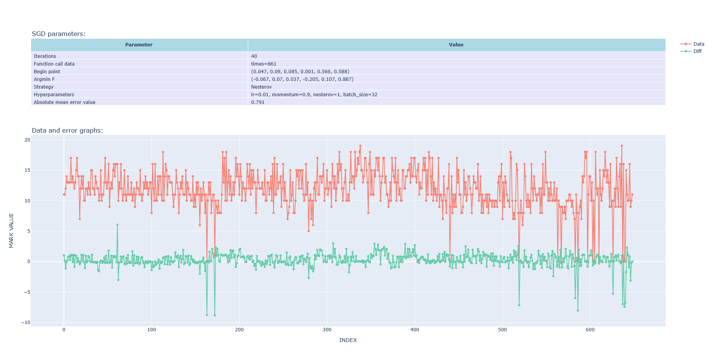
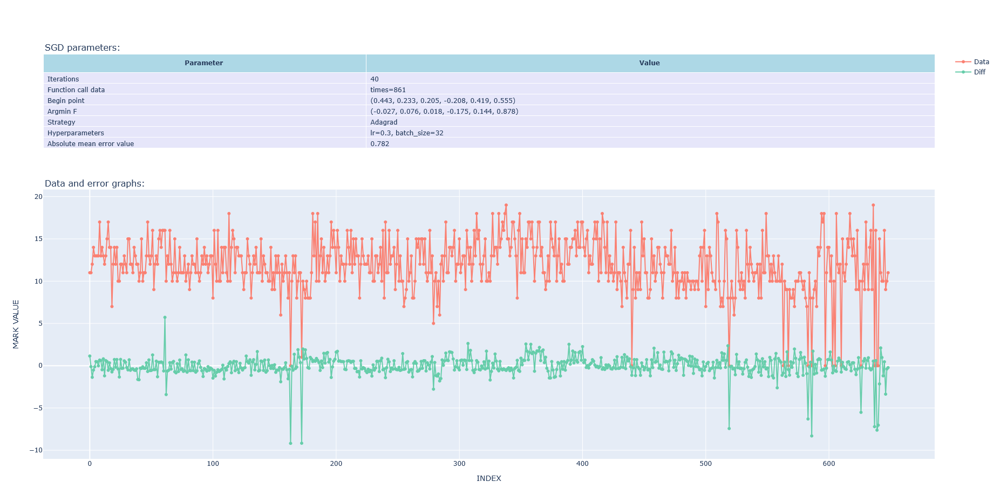

# Отчет по лабораторной работе №3 по дисциплине "Методы оптимизации"

## Сведения об авторах

Название команды: "Гипсокартонный лист (ГКЛ)"

Члены команды:

- Гилязов Валерий Русланович, М3232
- Кудрявцев Эдуард Сергеевич, М3235
- Лаптев Иван Александрович, М3232

## Используемые методы
1) Библиотека torch.optim
2) keras.optimizers
3) sgd_optimizer - реализованный нами метод

## Используемый DataSet

Эти данные отражают успеваемость учащихся в системе среднего образования двух португальских школ. 
Данные включают оценки учащихся, демографические, социальные и связанные со школой характеристики и были собраны
с использованием школьных отчетов и анкет. Представлены два набора данных об успеваемости по двум различным предметам: 
математике (mat) и португальскому языку (por). В работе [Cortez and Silva, 2008] эти два набора данных были смоделированы
с помощью задач бинарной/пятиуровневой классификации и регрессии. Важное примечание: целевой атрибут G3 имеет сильную
корреляцию с атрибутами G2 и G1.

## Графики:

### График 1 (sgd_optimizer)

[результат 1](#результат-1)

### График 2 (sgd_optimizer + L1)

[результат 2](#результат-2)

### График 3 (sgd_optimizer + L2)

[результат 3](#результат-3)

### График 4 (sgd_optimizer + Elastic)

[результат 4](#результат-4)

### График 5 (PyTorch, модификация Nesterov)

[результат 5](#результат-5)

### График 6 (PyTorch, модификация Momentum)

[результат 6](#результат-6)

### График 7 (PyTorch, модификация Adagrad)

[результат 7](#результат-7)

### График 8 (PyTorch, модификация RMSProp)

[результат 8](#результат-8)

### График 9 (PyTorch, модификация Adam)

[результат 9](#результат-9)

### График 10 (Keras, обычный SGD)

[результат 10](#результат-10)

### График 11 (Keras, Nesterov Momentum)

[результат 11](#результат-11)

### График 12 (Keras, AdaGrad)

[результат 12](#результат-12)

### График 13 (Keras, RMSProp)

[результат 13](#результат-13)

### График 14 (Keras, Adam)

[результат 14](#результат-14)

## Описание результатов

### Результат 1

[график 1](#график-1-sgd_optimizer)

| **Характеристика**                           | **Информация**                                                                                         |
|----------------------------------------------|--------------------------------------------------------------------------------------------------------|
| **Модификация:**                             | SGD                                                                                                    |
| **Значения гиперпараметров:**                | Стартовая точка = (0, 0, 0, 0, 0, 0)  $indent=1$ $count\ iterations=100$ $batch\ size=32$  |
| **Найденные параметры модели**               | (0.044, 0.08, -0.014, -0.003, 0.427, 0.589)                                                            |
| **Средняя величина абсолютной ошибки**       | 1.803                                                                                                  |
| **Количество итераций градиентного спуска:** | 45                                                                                                     |
| **Число вызовов функции потери:**            | 4590                                                                                                   |  

### Результат 2

[график 2](#график-2-sgd_optimizer--l1)

| **Характеристика**                           | **Информация**                                                                                         |
|----------------------------------------------|--------------------------------------------------------------------------------------------------------|
| **Модификация:**                             | SGD + L1 Regularization                                                                                |
| **Значения гиперпараметров:**                | Стартовая точка = (0, 0, 0, 0, 0, 0)  $indent=1$ $count\ iterations=100$ $batch\ size=32$  |
| **Найденные параметры модели**               | (0.005, 0.038, -0.011, -0.031, 0.425, 0.579)                                                           |
| **Средняя величина абсолютной ошибки**       | 1.916                                                                                                  |
| **Количество итераций градиентного спуска:** | 45                                                                                                     |
| **Число вызовов функции потери:**            | 4590                                                                                                   |  

### Результат 3

[график 3](#график-3-sgd_optimizer--l2)

| **Характеристика**                           | **Информация**                                                                                         |
|----------------------------------------------|--------------------------------------------------------------------------------------------------------|
| **Модификация:**                             | SGD + L2 Regularization                                                                                |
| **Значения гиперпараметров:**                | Стартовая точка = (0, 0, 0, 0, 0, 0)  $indent=1$ $count\ iterations=100$ $batch\ size=32$  |
| **Найденные параметры модели**               | (0.024, 0.058, 0.007, -0.031, 0.434, 0.584)                                                            |
| **Средняя величина абсолютной ошибки**       | 1.782                                                                                                  |
| **Количество итераций градиентного спуска:** | 45                                                                                                     |
| **Число вызовов функции потери:**            | 4590                                                                                                   |  

### Результат 4

[график 4](#график-4-sgd_optimizer--elastic)

| **Характеристика**                           | **Информация**                                                                                         |
|----------------------------------------------|--------------------------------------------------------------------------------------------------------|
| **Модификация:**                             | SGD + Elastic Regularization                                                                           |
| **Значения гиперпараметров:**                | Стартовая точка = (0, 0, 0, 0, 0, 0)  $indent=1$ $count\ iterations=100$ $batch\ size=32$  |
| **Найденные параметры модели**               | (0.03, 0.076, 0, -0.004, 0.478, 0.519)                                                                 |
| **Средняя величина абсолютной ошибки**       | 1.959                                                                                                  |
| **Количество итераций градиентного спуска:** | 45                                                                                                     |
| **Число вызовов функции потери:**            | 2754                                                                                                   |  

### Результат 5

[график 5](#график-5-pytorch-модификация-nesterov)

| **Характеристика**                           | **Информация**                                                                                                 |
|----------------------------------------------|----------------------------------------------------------------------------------------------------------------|
| **Модификация:**                             | Nesterov                                                                                                       |
| **Значения гиперпараметров:**                | Стартовая точка = (0.045, 0.095, 0.089, 0.006, 0.558, 0.582)  $learning\ rate=0.01$ $momentum = 0.9$  |
| **Найденные параметры модели**               | (-0.062, 0.119, -0.025, -0.136, 0.153, 0.915)                                                                  |
| **Средняя величина абсолютной ошибки**       | 0.876                                                                                                          |
| **Количество итераций градиентного спуска:** | 40                                                                                                             |
| **Число вызовов функции потери:**            | 861                                                                                                            |               

### Результат 6

[график 6](#график-6-pytorch-модификация-momentum)

| **Характеристика**                           | **Информация**                                                                                                  |
|----------------------------------------------|-----------------------------------------------------------------------------------------------------------------|
| **Модификация:**                             | Momentum                                                                                                        |
| **Значения гиперпараметров:**                | Стартовая точка = (0.042, 0.092, 0.121, -0.01, 0.553, 0.591)  $learning\ rate=0.01$ $momentum = 0.85$  |
| **Найденные параметры модели**               | (-0.062, 0.119, -0.025, -0.136, 0.153, 0.915)                                                                   |
| **Средняя величина абсолютной ошибки**       | 0.776                                                                                                           |
| **Количество итераций градиентного спуска:** | 40                                                                                                              |
| **Число вызовов функции потери:**            | 861                                                                                                             |  

### Результат 7

[график 7](#график-7-pytorch-модификация-adagrad)

| **Характеристика**                           | **Информация**                                                                           |
|----------------------------------------------|------------------------------------------------------------------------------------------|
| **Модификация:**                             | Adagrad                                                                                  |
| **Значения гиперпараметров:**                | Стартовая точка = (0.291, 0.231, 0.029, -0.438, 0.36, 0.48)  $learning\ rate=0.3$  |
| **Найденные параметры модели**               | (-0.155, 0.054, 0.016, -0.181, 0.135, 0.874)                                             |
| **Средняя величина абсолютной ошибки**       | 0.793                                                                                    |
| **Количество итераций градиентного спуска:** | 40                                                                                       |
| **Число вызовов функции потери:**            | 861                                                                                      |  

### Результат 8

[график 8](#график-8-pytorch-модификация-rmsprop)

| **Характеристика**                           | **Информация**                                                                                             |
|----------------------------------------------|------------------------------------------------------------------------------------------------------------|
| **Модификация:**                             | RMSProp                                                                                                    |
| **Значения гиперпараметров:**                | Стартовая точка = (0.297, 0.292, 0.256, 0.252, 0.297, 0.298)  $learning\ rate=0.01$ alpha = 0.9$  |
| **Найденные параметры модели**               | (-0.077, 0.105, 0.022, -0.258, 0.146, 0.885)                                                               |
| **Средняя величина абсолютной ошибки**       | 0.796                                                                                                      |
| **Количество итераций градиентного спуска:** | 40                                                                                                         |
| **Число вызовов функции потери:**            | 861                                                                                                        |  

### Результат 9

[график 9](#график-9-pytorch-модификация-adam)

| **Характеристика**                           | **Информация**                                                                                                       |
|----------------------------------------------|----------------------------------------------------------------------------------------------------------------------|
| **Модификация:**                             | Adam                                                                                                                 |
| **Значения гиперпараметров:**                | Стартовая точка = (0.383, 0.354, 0.038, -0.0173, 0.5, 0.569)  $learning\ rate=0.01$ $betas = (0.9, 0.999)$  |
| **Найденные параметры модели**               | (-0.168, 0.139, 0.012, -0.177, 0.124, 0.866)                                                                         |
| **Средняя величина абсолютной ошибки**       | 0.823                                                                                                                |
| **Количество итераций градиентного спуска:** | 40                                                                                                                   |
| **Число вызовов функции потери:**            | 861                                                                                                                  |  

### Результат 10

[график 10](#график-10-keras-обычный-sgd)

| **Характеристика**                           | **Информация**                                                                                                              |
|----------------------------------------------|-----------------------------------------------------------------------------------------------------------------------------|
| **Модификация:**                             | SGD                                                                                                                         |
| **Значения гиперпараметров:**                | Стартовая точка = (0, 0.694, 0.451, -0.667, 0.842, 0.338)  $learning\ rate=0.001$ $batch\ size=32$ $epochs=80$  |
| **Найденные параметры модели**               | (-0.065, 0.182, 0.024, -0.43, 0.184, 0.834)                                                                                 |
| **Средняя величина абсолютной ошибки**       | 1.598                                                                                                                       |
| **Количество итераций градиентного спуска:** | 80                                                                                                                          |
| **Число вызовов функции потери:**            | 3                                                                                                                           |  

### Результат 11

[график 11](#график-11-keras-nesterov-momentum)

| **Характеристика**                           | **Информация**                                                                                                               |
|----------------------------------------------|------------------------------------------------------------------------------------------------------------------------------|
| **Модификация:**                             | Nesterov Momentum                                                                                                            |
| **Значения гиперпараметров:**                | Стартовая точка = (0, 0.925, 0.958, -0.505, 0.083, -0.025)  $learning\ rate=0.001$ $batch\ size=32$ $epochs=80$  |
| **Найденные параметры модели**               | (-0.059, 0.236, 0.02, -0.377, 0.16, 0.839)                                                                                   |
| **Средняя величина абсолютной ошибки**       | 1.582                                                                                                                        |
| **Количество итераций градиентного спуска:** | 80                                                                                                                           |
| **Число вызовов функции потери:**            | 3                                                                                                                            |  

### Результат 12

[график 12](#график-12-keras-adagrad)

| **Характеристика**                           | **Информация**                                                                                                             |
|----------------------------------------------|----------------------------------------------------------------------------------------------------------------------------|
| **Модификация:**                             | AdaGrad                                                                                                                    |
| **Значения гиперпараметров:**                | Стартовая точка = (0, -0.475, -0.248, -0.533, 0.323, -0.558)  $learning\ rate=3$ $batch\ size=32$ $epochs=80$  |
| **Найденные параметры модели**               | (-0.354, 0.096, 0.013, -0.135, 0.181, 0.87)                                                                                |
| **Средняя величина абсолютной ошибки**       | 1.572                                                                                                                      |
| **Количество итераций градиентного спуска:** | 80                                                                                                                         |
| **Число вызовов функции потери:**            | 3                                                                                                                          |  

### Результат 13

[график 13](#график-13-keras-rmsprop)

| **Характеристика**                           | **Информация**                                                                                                             |
|----------------------------------------------|----------------------------------------------------------------------------------------------------------------------------|
| **Модификация:**                             | RMSProp                                                                                                                    |
| **Значения гиперпараметров:**                | Стартовая точка = (0, 0.636, -0.363, 0.871, 0.04, -0.901)  $learning\ rate=0.01$ $batch\ size=32$ $epochs=80$  |
| **Найденные параметры модели**               | (-0.291, 0.104, 0.053, -0.176, 0.184, 0.851)                                                                               |
| **Средняя величина абсолютной ошибки**       | 1.59                                                                                                                       |
| **Количество итераций градиентного спуска:** | 80                                                                                                                         |
| **Число вызовов функции потери:**            | 3                                                                                                                          |  

### Результат 14

[график 14](#график-14-keras-adam)

| **Характеристика**                           | **Информация**                                                                                                              |
|----------------------------------------------|-----------------------------------------------------------------------------------------------------------------------------|
| **Модификация:**                             | Adam                                                                                                                        |
| **Значения гиперпараметров:**                | Стартовая точка = (0, -0.255, 0.552, -0.617, -0.565, 0.082)  $learning\ rate=0.1$ $batch\ size=32$ $epochs=80$  |
| **Найденные параметры модели**               | (-0.467, 0.124, 0.024, -0.217, 0.178, 0.862)                                                                                |
| **Средняя величина абсолютной ошибки**       | 1.57                                                                                                                        |
| **Количество итераций градиентного спуска:** | 80                                                                                                                          |
| **Число вызовов функции потери:**            | 3                                                                                                                           |  

